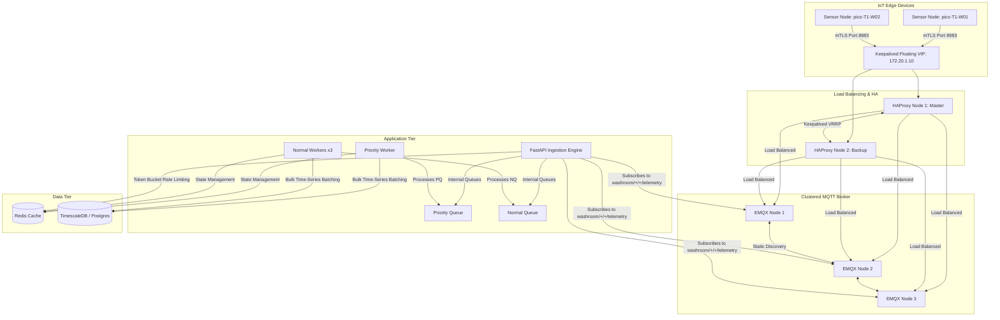
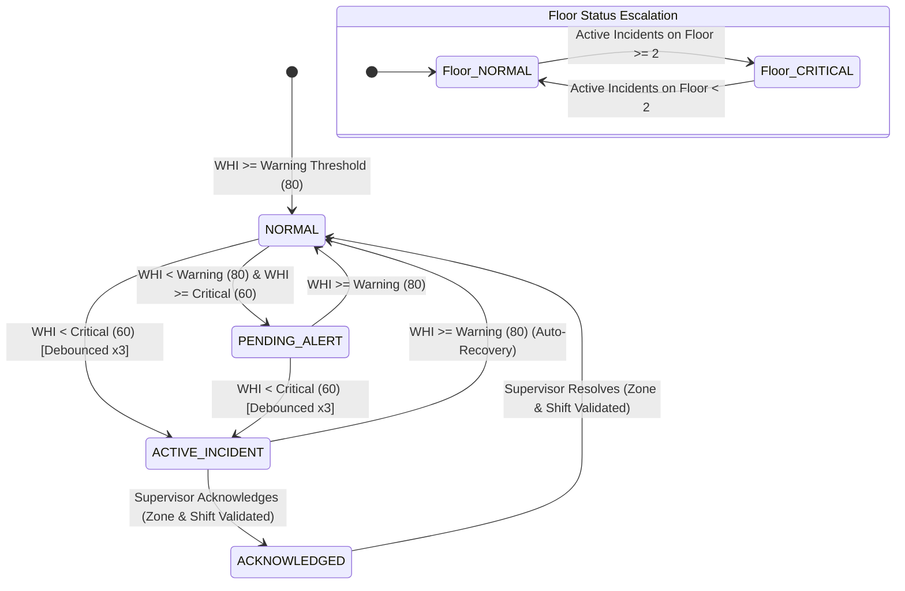

# ODOUR_DETECTION_SYSTEM

The **AAI Intelligent Washroom Monitoring Pipeline** is a highly secure, high-availability, and scalable IoT telemetry ingestion, state tracking, and incident escalation system. 

It is designed to monitor public washroom hygiene, throughput, and occupancy in real-time, compute a live **Washroom Hygiene Index (WHI)**, manage incident state machines, and automatically escalate floor statuses under critical conditions.

---

## 🏗️ System Architecture

The pipeline utilizes a clustered, load-balanced, and containerized microservices architecture to process time-series telemetry data at scale.



### Key Components

1. **Load Balancing & High Availability (HAProxy + Keepalived)**:
   - Dual HAProxy nodes (`haproxy1`, `haproxy2`) act as the reverse proxy and SSL/TLS termination endpoint.
   - Keepalived manages a floating Virtual IP (VIP: `172.20.1.10`) using the Virtual Router Redundancy Protocol (VRRP). If the master HAProxy node fails, the IP automatically switches to the backup node.
   - External traffic (MQTT over SSL on `8883`, EMQX Dashboard on `18083`, FastAPI REST API on `443`) is terminated and load-balanced via HAProxy.

2. **MQTT Broker Cluster (EMQX)**:
   - A 3-node clustered EMQX deployment (`emqx1`, `emqx2`, `emqx3`) using static node discovery.
   - Enforces mutual TLS (mTLS) for all connecting devices and clients, authenticating connections using a custom Private CA.

3. **FastAPI Application & Workers**:
   - Subscribes to telemetry (`washroom/+/+/telemetry`) and alerts (`washroom/+/+/alerts`) topics.
   - Utilizes separate memory-backed Python `asyncio` queues: a **Priority Queue** (for alerts/critical readings) and a **Normal Queue** (for standard telemetry).
   - One dedicated `priority_worker` and three concurrent `normal_worker` instances handle ingestion to avoid write bottlenecks.
   - Rates of incoming device payloads are governed using a **Token Bucket** rate-limiting mechanism backed by Redis.

4. **Data Cache & State Storage (Redis)**:
   - Stores current washroom states, debouncing counters, incident states, and rate-limiting buckets.

5. **Time-Series Ingestion & Analytics (Postgres + TimescaleDB)**:
   - Telemetry data is buffered in Redis and flushed in batches to TimescaleDB to optimize write performance.
   - Uses hypertables to efficiently manage millions of rows of time-series data.

---

## 🔒 Security & Attribute-Based Access Control (ABAC)

The application enforces a rigorous zero-trust security paradigm:

1. **PKI & Certificate Generation (`setup_security.sh`)**:
   - Establishes a Private Root Certificate Authority (CA).
   - Issues discrete server and client certificates for HAProxy, EMQX, TimescaleDB, the FastAPI backend, and individual edge devices.
   - Ensures all data-in-transit (MQTT, REST API, Database connections) is encrypted via TLS 1.3.

2. **Immutable Audit Logs**:
   - Critical time-series log tables (`incident_events`, `floor_escalation_events`, and `raw_telemetry_audit`) are protected by PL/pgSQL database triggers (`freeze_historical_logs`).
   - Any attempt by any user or application role to update or delete rows in these tables throws a security exception.

3. **Least-Privilege Database Role**:
   - The FastAPI worker runs under a restricted database role `aai_app_worker`, limiting access exclusively to `SELECT` and `INSERT` privileges on necessary tables.

4. **Attribute-Based Access Control (ABAC)**:
   - Users are assigned a **Role** (`dashboard_operator`, `supervisor`, `admin`), an optional **Zone** (e.g., Terminal `T1`, `T2`), and a **Shift Schedule** (`shift_start`, `shift_end`).
   - Incident acknowledgment and resolution require the user to be a `supervisor`, assigned to the matching washroom zone (terminal), and currently on duty (active shift window).
   - Edge devices (e.g., `pico-T1-W01`) can only retrieve their own configurations using their mTLS credentials.

---

## 💾 Database Schema

The database utilizes the following tables (initialized via `db_init/01-init.sql`):

*   **`users`**: Manages application credentials and authorization attributes (Roles, Zones, Shift windows).
*   **`washroom_telemetry`** *(TimescaleDB Hypertable)*: Stores metrics including NH3 levels (average and peak), temperature, humidity, throughput, occupancy, abandon rate, and the Washroom Hygiene Index (WHI).
*   **`incident_events`** *(TimescaleDB Hypertable, Immutable)*: Tracks every state transition of washroom incidents (e.g., `NORMAL` ➔ `PENDING_ALERT` ➔ `ACTIVE_INCIDENT` ➔ `ACKNOWLEDGED`).
*   **`floor_escalation_events`** *(TimescaleDB Hypertable, Immutable)*: Logs floor-wide critical events when $\ge 2$ washrooms on a single floor trigger active incidents simultaneously.
*   **`raw_telemetry_audit`** *(TimescaleDB Hypertable, Immutable)*: Preserves exact raw payloads before parsing, with a 14-day automated data retention policy.

---

## 🚦 Incident & Escalation State Machine



*   **Debouncing**: A transient dip in WHI will not raise an alert. An incident escalates to `ACTIVE_INCIDENT` only if critical thresholds are breached consecutively for 3 ticks.
*   **Floor Escalation**: The `EscalationEngine` aggregates active incident statuses. If multiple washrooms on a given level (e.g., Floor `L2`) are simultaneously in an `ACTIVE_INCIDENT` state, the entire floor status escalates to `FLOOR_CRITICAL`.

---

## 🛠️ Getting Started

### Prerequisites

*   **Docker & Docker Compose**
*   **OpenSSL** (for certificate generation)

### Installation & Run

1.  **Generate Certificates & Secrets**:
    Run the security setup script to populate certificates and generate secure random credentials:
    ```bash
    chmod +x setup_security.sh
    ./setup_security.sh
    ```

2.  **Start the Stack**:
    Build and launch the containers in the background:
    ```bash
    docker compose up --build -d
    ```

3.  **Check Services Status**:
    Ensure all components are running and healthy:
    ```bash
    docker compose ps
    ```

---

## 📡 API Reference

All requests must include a Bearer JWT Token in the `Authorization` header, obtained via the login endpoint.

| Endpoint | Method | Role | Description |
| :--- | :--- | :--- | :--- |
| `/auth/login` | `POST` | Public | Authenticates and returns JWT Access & Refresh Tokens. |
| `/auth/refresh` | `POST` | Public | Rotates Access & Refresh tokens. |
| `/auth/logout` | `POST` | Authenticated | Revokes all active refresh tokens for the user. |
| `/dashboard/status` | `GET` | Operator / Supervisor | Returns floor statuses. Restricted by Zone ABAC attributes. |
| `/incidents/{id}/acknowledge` | `POST` | Supervisor | Acknowledges an active washroom incident (ABAC enforced). |
| `/incidents/{id}/resolve` | `POST` | Supervisor | Resolves an active/acknowledged incident (ABAC enforced). |
| `/alerts/dispatch` | `POST` | Supervisor | Dispatches manual alerts to operators (ABAC enforced). |
| `/devices/{id}/config` | `GET` | Authenticated / Device | Returns poll intervals. Devices are restricted to their own ID. |
| `/admin/users/{username}/attributes` | `PUT` | Admin | Updates user ABAC attributes (Zone, shift times). |

---

## 🧪 Testing & Benchmarks

The repository includes a comprehensive test suite in the `tests/` directory:

*   **Unit & Integration Tests**:
    *   `test_core_auth.py`: Tests cryptography operations, password hashing, and token signatures.
    *   `test_auth_routes.py`: Verifies JWT issuance, rotation, and logout behaviors.
    *   `test_abac.py`: Validates role, zone, and shift-based endpoint access control.
    *   `test_audit.py`: Validates the immutability of audit and event tables in the database.
    *   `test_batcher.py`: Verifies batched database inserts and telemetry buffering.
    *   `test_escalation.py` & `test_immutable_triggers.py`: Tests the incident state machine and write-only constraints.
*   **Performance Benchmarks & Simulation**:
    *   `benchmark_latency.py`: Evaluates endpoint response times under load.
    *   `benchmark_process_message.py`: Measures telemetry worker throughput.
    *   `publish_dummy_mqtt.py`: Simulates active sensor telemetry streams.
    *   `simulate_escalation.py`: Triggers dummy incidents to validate floor-level escalations.
